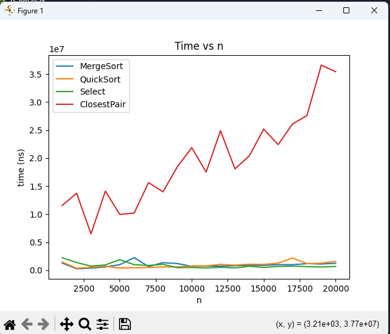
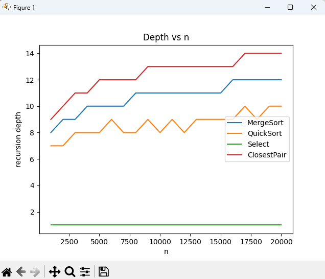
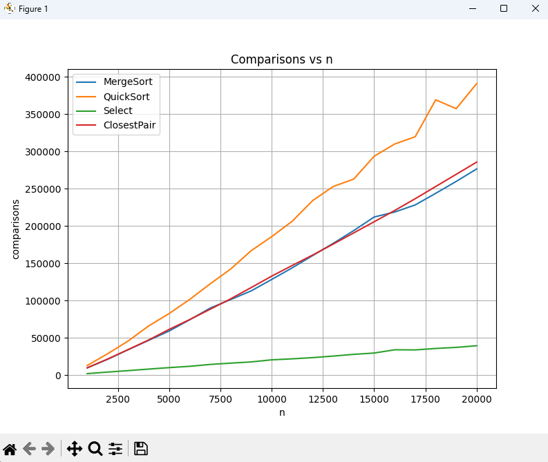
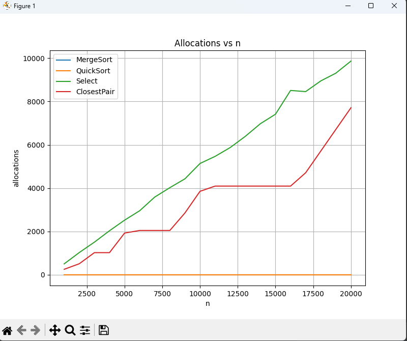

# Assignment 1 Report

## Learning Goals
- Implement classic divide-and-conquer algorithms with safe recursion patterns.
- Analyze running-time recurrences using the Master Theorem (3 cases) and Akra–Bazzi intuition, then check them with experiments.
- Collect metrics (time, recursion depth, comparisons, allocations) and summarize results in a short report with clean Git history.

---

## Architecture Notes
- We added a `Metrics` class to count:
    - **comparisons** (every time elements are compared),
    - **allocations** (when new arrays or lists are created),
    - **recursion depth** (tracked with `enterRecursion()` / `exitRecursion()`),
    - **time** (measured with `System.nanoTime`).
- Each algorithm has two versions:
    - a **clean version** (for correctness tests),
    - a **measured version** (to collect metrics).

---

## Recurrence Analysis

- **MergeSort**  
  Recurrence: `T(n) = 2T(n/2) + Θ(n)` → Θ(n log n)  
  (Master theorem, case 2).

- **QuickSort (randomized, smaller-first recursion)**  
  Average recurrence: `T(n) = T(n/2) + T(n/2) + Θ(n)` → Θ(n log n).  
  Recursion depth is O(log n) with high probability.

- **Deterministic Select (Median-of-Medians)**  
  Recurrence: `T(n) = T(n/5) + T(7n/10) + Θ(n)` → Θ(n).  
  (Solved by Akra–Bazzi).

- **Closest Pair of Points (2D)**  
  Recurrence: `T(n) = 2T(n/2) + Θ(n)` → Θ(n log n).  
  (Master theorem, case 2).

---

## Experimental Plots

### Time vs n

- MergeSort, QuickSort, and Select grow about ~ n log n (or ~ n for Select).
- ClosestPair also grows ~ n log n, but runs slower because of extra work with 2D points.

### Depth vs n

- MergeSort depth grows like log₂(n).
- QuickSort depth is also ~ log₂(n), kept smaller thanks to the “smaller-first” recursion.
- Select has lower depth since it only recurses into one side.
- ClosestPair also follows ~ log₂(n).

### Comparisons vs n

- MergeSort and QuickSort comparisons grow ~ n log n.
- Select is closer to linear (Θ(n)).
- ClosestPair also shows ~ n log n because of the strip check.

### Allocations vs n

- MergeSort: always 1 (single buffer).
- QuickSort: near zero, works in-place.
- Select: also near zero (in-place).
- ClosestPair: grows slightly with n due to strip creation.

---

## Discussion / Analysis

The experiments matched theory well:
- MergeSort and QuickSort grew ~ n log n in both time and comparisons, with recursion depth ~ log₂(n).
- Deterministic Select grew linearly, but was slower than QuickSort on small inputs because of larger constant costs.
- Closest Pair also grew ~ n log n, but was slower than the sorts because of extra geometric checks.

Some runs showed small ups and downs in timing. These are explained by JVM warm-up, garbage collection, and CPU caching. They add noise but do not change the overall growth trend.

---

## Summary

- **Theory vs Practice:** The measured growth rates matched theory (MergeSort, QuickSort, Closest Pair ~ n log n; Select ~ n).
- **Differences:** Select was slower on small inputs; Closest Pair had the biggest constant factors.
- **Constant Factors:** JVM, GC, and caching explain the small runtime fluctuations.

**Final note:** The experiments confirmed the theory. The asymptotics matched, and the differences we saw came only from constant factors in real execution.  
